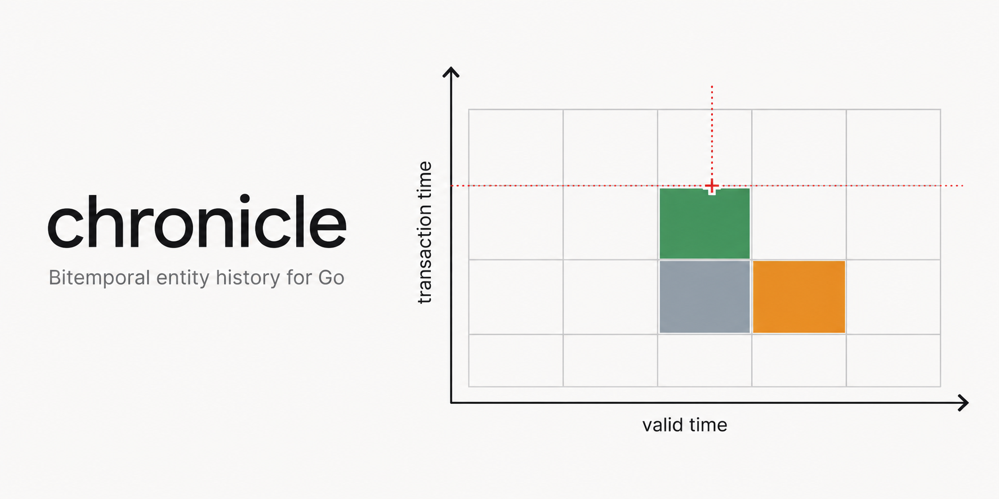

<p align="center">
  <a href="https://zkrebbekx.github.io/chronicle/">
    
  </a>
</p>

# chronicle

Bitemporal entity change history for Go — an ORM-agnostic, queryable record of
what your entities were, and of what you believed they were at any point in the
past.

Every enterprise product reimplements entity history, and most get the same
thing wrong: they keep one time axis. That answers "what is Alice's salary" and
"what was it in March", and then answers "what did we believe in April that her
March salary had been" with today's belief about March — confidently, and
wrongly, because a retroactive correction rewrote what the system appears to
have known. That third question is the one that settles audits and disputes,
and it needs a second axis.

- **Two independent time axes.** *Valid time* is when a fact was true in the
  world and you supply it. *Transaction time* is when chronicle learned it; the
  system assigns it, you cannot set it, and it is never rewritten. There is no
  exported way to write the transaction axis, which is the whole basis for
  trusting the log.
- **Non-destructive by construction.** Nothing is ever updated in place or
  deleted. An overlapping write closes the superseded records' transaction
  interval and writes replacements — which is exactly what 21 CFR 11.10(e)
  means by "record changes shall not obscure previously recorded information",
  with no cryptography involved.
- **A real query surface.** Filter by kind, entity, actor, intent and time
  range on *either* axis, with deterministic keyset pagination behind an opaque
  cursor. The nearest Go alternative's entire storage interface is
  `Store/Get/Has/Clear` on one opaque string, with no time parameter anywhere.
- **Structural field-level diffs.** Nested objects and arrays to any depth,
  RFC 6901 JSON Pointer paths, exact number comparison. A codec failure is an
  error, never a silently empty diff.
- **Required actor attribution.** No ambient default, no silent "system".
- **A compliance layer that says what it is.** Retention schedules behind an
  explicit sweeper with a dry run, legal holds with backdatable effective
  instants that always beat retention, opt-in hash chaining with its threat
  model stated rather than implied, and per-subject crypto-shredding with no
  GDPR claim attached. Every design choice here traces to primary regulatory
  text or is labelled as not required by any — see
  [docs/COMPLIANCE.md](docs/COMPLIANCE.md).
- **Zero dependencies.** Standard library only. Go 1.23+.

```go
import "github.com/zkrebbekx/chronicle"
```

**[Try the playground →](https://zkrebbekx.github.io/chronicle/)** — a zero-backend,
in-browser demo that makes the two time axes clickable. Load the *retroactive
salary correction* story and watch the old belief and the correction coexist as
two boxes on the valid-time × transaction-time grid.

> **Status: released.** The core model, the in-memory store, the Postgres
> adapter, the compliance layer (retention, legal hold, optional tamper
> evidence, crypto-shredding), field-level history, and the `chronicled` REST
> service are all in and tagged — root `v0.2.0`, `pgstore/v0.1.2`,
> `chronicled/v0.2.0`. Try it in the browser: the
> [playground](https://zkrebbekx.github.io/chronicle/) compiles the library to
> WebAssembly and makes the two time axes clickable. See
> [docs/DESIGN.md](docs/DESIGN.md).

## The question that justifies the library

```go
log := chronicle.NewLog(chronicle.NewMemStore())
hr := chronicle.Actor{ID: "u-42", Name: "Dana"}

// In March, we record that Alice earns 50000 effective 1 March.
first, _ := log.Put(ctx, "employee", "alice",
    []byte(`{"salary":50000}`), march, time.Time{}, hr)

// In April, we discover the figure was wrong — it was always 60000.
log.Correct(ctx, "employee", "alice",
    []byte(`{"salary":60000}`), march, time.Time{}, hr)

now, _  := log.Get(ctx, "employee", "alice", chronicle.ValidAt(march))
then, _ := log.Get(ctx, "employee", "alice",
    chronicle.As{ValidAt: march, TxAt: first.TxAt})

now.Data  // {"salary":60000}  — what we believe today about March
then.Data // {"salary":50000}  — what we believed in March about March
```

Both answers are correct, and they are different. A uni-temporal log can only
give you the first.

## Half-open intervals, and the zero time

Both axes are half-open `[from, to)`. An unbounded end is the **zero
`time.Time`**, never a sentinel maximum — zero is unambiguous in Go, survives
marshalling, cannot collide with a real instant, and maps to SQL `NULL`.

A zero `ValidTo` means the fact still holds. A zero `ValidFrom` means it always
did. A zero `TxTo` means the record is current belief.

Reading a zero time correctly depends on which end of an interval it sits at —
a zero lower bound is −∞ and a zero upper bound is +∞. Getting that backwards
is *the* bitemporal bug, so all of it lives in one type:

```go
chronicle.Between(march, june)  // [march, june)
chronicle.Since(march)          // [march, ∞)
chronicle.Until(june)           // [-∞, june)
chronicle.Always()              // all of time; the zero Interval

chronicle.Between(march, june).Overlaps(chronicle.Since(june)) // false — adjacent
```

Use `Interval`'s methods rather than comparing record timestamps yourself.

Zero values are meaningful throughout, and they do not all mean the same
thing — the two worth keeping apart are `As` (zero means *now*) and `Query`
(zero means *no restriction*):

| Type | Its zero value means |
|---|---|
| `Interval` | all of time (`Always()`) |
| `As` | now, on both axes, resolved when the read is made |
| `Query` | match everything: no filters, no limit, ascending |
| `GetQuery` | a real point — the zero instants are year-1 coordinates, not wildcards; `Log.Get` resolves "now" before the store ever sees the query |
| `Cursor` | passed in: start at the beginning; returned: no next page |

## Writes split intervals

`Put` and `Correct` run the same algorithm and are identical in storage; they
differ only in the recorded `Intent`, which is what makes a retroactive fix
distinguishable from an ordinary late-arriving fact.

```go
log.Put(ctx, "employee", "alice", []byte(`{"grade":"L3"}`), march, time.Time{}, hr)
log.Put(ctx, "employee", "alice", []byte(`{"grade":"L4"}`), april, june, hr)

// [2026-03-01, 2026-04-01)  {"grade":"L3"}
// [2026-04-01, 2026-06-01)  {"grade":"L4"}
// [2026-06-01, ∞)           {"grade":"L3"}
```

`PutInterval` and `CorrectInterval` are the same two operations taking an
`Interval` value rather than a pair of instants — handy at call sites that
already hold one.

To record that a fact **stopped being true**, assert it with a bounded
`ValidTo` — a `Put` of the same state over `[from, end)` closes the open-ended
version and leaves the timeline uncovered after `end`, which is the honest
shape for "we do not assert anything from then on". Where "ended" is itself a
fact worth recording, write a successor state that says so in its data (a
status field, or JSON `null`), so readers find an assertion rather than an
absence.

The uncovered parts of the superseded record are rewritten as **remainders**.
A remainder carries the *superseded record's* actor, reason and metadata, and
is marked `IntentRemainder` — it re-asserts a fact its original author
asserted, and stamping the splitting writer on it would have the log claim they
said something they never said. Nothing is lost: a remainder shares its
`TxFrom` with the write that produced it, so the `IntentAssert` or
`IntentCorrection` record at that same instant identifies who caused the split.

**The invariant, which is the point of the library:** at any transaction
instant, an entity's current valid intervals do not overlap, and no write
introduces a gap where the timeline was previously covered. This is asserted
after every step of a seeded property test over long randomised write
sequences, and under `go test -fuzz`.

## Transaction time is ratcheted

Two writes must never share a transaction instant — a record superseded by the
write immediately following it would be left with an empty transaction interval
that no as-of query could ever observe.

So chronicle ratchets: a write whose clock reading fails to advance on the
previous one is assigned **the previous instant plus one nanosecond**.
Transaction timestamps within a `Log` are strictly increasing whatever the
clock does, including a frozen test clock or a clock that jumps backwards.

The alternative — letting timestamps tie and ordering on a separate sequence
number — pushes the tiebreak into every reader and every downstream query.
Ratcheting keeps it in one place. The cost is that transaction time can lead
the wall clock by a nanosecond per write under sustained load, which
self-corrects as soon as the write rate drops.

The ratchet is per-`Log`, and a `Log`'s clock is only authoritative when it is
the only writer. `Store.Apply` therefore *owns* the transaction axis: it picks
the instant, stamps it on everything the write inserts and closes, and returns
it, and the log adopts whatever comes back. `MemStore` accepts the log's
proposal because a `MemStore` has exactly one `Log` writing to it. `pgstore`
takes the instant from the database, so any number of processes and any number
of `Log` values over one store still produce a single ordered history.

## Reads

```go
log.Get(ctx, kind, id, as)                 // one record, both axes
log.History(ctx, kind, id, opts...)        // every version ever, superseded included
log.Timeline(ctx, kind, id, as)            // valid-time sequence at one belief instant
log.Diff(ctx, kind, id, from, to)          // field-level changes between two points
log.FieldHistory(ctx, kind, id, path, as)  // one field's changes over transaction time
log.Query(ctx, q)                          // cross-entity, filtered, paginated
```

`As{ValidAt, TxAt}` locates a point in bitemporal space; a zero field means
"now". `chronicle.Now()`, `ValidAt(t)`, `Believed(tx)` and `AsOf(t)` cover the
common cases.

Pagination is keyset, ordered by transaction start, then valid start, then the
unique record ID. Because the ID is the final tiebreaker the order is total, so
no row can be skipped or repeated at a page boundary however many records share
a timestamp:

```go
var cursor chronicle.Cursor
for {
    page, next, err := log.Query(ctx, chronicle.Query{
        Kind: "employee", ActorID: "u-42", Limit: 100, After: cursor,
    })
    if err != nil {
        return err
    }
    // ... use page ...
    if next.IsZero() {
        break
    }
    cursor = next
}
```

The cursor is opaque, URL-safe and checksummed; a mangled one is
`ErrInvalidCursor` rather than a silently wrong page.

## Diffing

`Diff` decodes record data through a `Codec` (JSON by default) and compares the
decoded structures, reporting each change with an RFC 6901 JSON Pointer path.

```go
// modified /address/city    Leeds -> York
// modified /salary          50000 -> 60000
// added    /tenured         <nil> -> true
```

It descends into nested objects and arrays to any depth. A change of *shape* at
a node — an object becoming a scalar — is reported once at that node rather
than as a burst of unrelated additions and removals. Objects compare by key, so
reordering keys is not a change. Numbers compare **by value, exactly** — no
`float64` round trip, so integers beyond its range compare correctly, and a
change of notation (`1` to `1.0`, `100` to `1e2`) is not a change of value.

**Documented limitation:** arrays are compared **by position**. Inserting an
element at the head of an array reports every later element as modified plus
one addition at the end, rather than a single insertion. Reporting it as an
insertion needs an alignment heuristic — an LCS over values, or a per-array
identity field — and a heuristic that misfires on the cases it does not fit
would be worse than a rule that is simple and stated.

A codec failure is `ErrCodec`, never an empty diff. A change log that reports
"nothing changed" when it means "I could not tell" is worse than one that
fails.

## Field history

`FieldHistory` is the single-field audit trail — the read this whole design
promised, in its most focused form. Fix a point in *valid* time and it walks how
the recorded value of one field changed over *transaction* time: who changed it,
when we learned it, and whether it was an assertion or a correction.

```go
revs, _ := log.FieldHistory(ctx, "employee", "alice", "/salary", chronicle.ValidAt(march))
// revs[0]: absent -> 50000   txAt=T1  intent=assert      actor=alice
// revs[1]: 50000  -> 55000   txAt=T2  intent=correction  actor=bob   ← when we found we were wrong
```

It is a walk along the transaction axis at a fixed valid point, **not** along
valid time — the part uni-temporal systems cannot express at all. The `path` is
an RFC 6901 JSON Pointer in the exact grammar `Diff` emits, and equality is
`Diff`'s, so a value re-recorded in different notation (`100` then `100.0`) is
not a change and a field that never appears is an empty result, not an error. A
malformed pointer is `ErrInvalidPath`; an undecodable record is `ErrCodec`,
never a silent gap.

Each side of a change carries a `present` flag, so a field **absent** from the
object stays distinct from one explicitly set to JSON **null** — the classic
subtle bug in a field-level trail, and two genuinely different facts here.

It is a read-side composition over `Query` and the diff comparison: it adds no
`Store` method and no schema, so it works identically on `MemStore` and Postgres
and is exercised on both by the conformance suite. Cost is linear in the number
of beliefs ever recorded about the fixed valid point — one query, paged
internally, one decode each — and independent of the rest of the log. A
present→absent change comes from a later belief that still covers the point but
drops the field (a correction that omits it, or a `null`-body tombstone); an
ordinary `Put`/`Correct` cannot instead make the *coverage* lapse, because the
superseded record's tail is preserved as a remainder carrying the old value
across the point.

## Storage

```go
type Store interface {
    Apply(ctx context.Context, req ApplyRequest) (time.Time, error)
    Get(ctx context.Context, q GetQuery) (*Record, error)
    Query(ctx context.Context, q Query) ([]Record, Cursor, error)
}

type ApplyRequest struct {
    Entity EntityRef // what to lock
    Valid  Interval  // which current records the plan needs
    TxAt   time.Time // the log's proposed instant
    Plan   Planner
}

// Planner computes the write from the entity's current overlapping records,
// read inside the store's transaction, and the instant the store assigned.
type Planner func(current []Record, txAt time.Time) (Write, error)

type Write struct {
    Supersede []RecordID
    Insert    []Record
}
```

A write supersedes some records and inserts others, and the two must land
together or a reader sees a gap or an overlap in valid time. `Apply` carries
both halves, and there is deliberately no way to express them separately.

**`Apply` takes a plan, not a finished write**, and that shape is the whole
isolation story. A write to one entity is a read-modify-write: read the
overlapping records, compute the split, apply it. All three have to be one
indivisible step. So the store does the read itself, inside its own transaction
and under its own lock, hands the records to the plan, and applies what comes
back without releasing either. chronicle's temporal reasoning stays above the
store — a store never learns what a remainder is — but it runs where the store
can protect it.

The earlier shape, where the log read through `Query` and passed a finished
`Write` to `Apply`, was correct and **starved**. With the read outside the lock,
the writer that waits for the lock always finds its plan stale by the time it
gets in, and the writer that never waits never conflicts — so one writer lands
everything and the other lands nothing. That is a stable equilibrium, not a
probabilistic tail, and it was measured at 100% starvation of one of two writers
over eighty writes. No isolation level fixes it, because no isolation level
spans two separate calls.

`Apply` returns the transaction instant it actually assigned, and stamps it on
everything the write inserts and closes. `ApplyRequest.TxAt` is only a proposal:
a store with more than one writing process substitutes an instant of its own —
no single process's clock is authoritative — and the log adopts what comes back.

`StaticWrite` wraps an already-decided `Write` as a `Planner`, for seeding and
migrations. It opts out of the protection above, so a store may reject it with
`ErrConflict` — and since the `Log` never issues a `StaticWrite`, retrying one
is its caller's job. The `Log`'s own retry loop (`DefaultWriteRetries`
attempts, tuned by `WithWriteRetries`) covers the conflicts its *planned*
writes can still meet: something other than chronicle writing an overlapping
record into the same table.

Ordinary callers never build an `ApplyRequest` — the `Log` constructs one for
every write; only store implementers and seeding or migration code touch the
type directly.

`MemStore` is the reference implementation and is safe for concurrent use.
`pgstore` is the Postgres adapter — see below.

## Conformance

`chroniclefest` is the store contract as an executable specification. Point it
at a factory and it exercises the whole surface — half-open boundaries, cursor
ties, page boundaries, supersession idempotence, the non-overlap invariant:

```go
func TestMyStore(t *testing.T) {
    chroniclefest.Run(t, func(t chroniclefest.T) chronicle.Store {
        return mystore.New(...)
    })
}
```

It runs against `MemStore` and `pgstore` on every build, which is what keeps the
two answering identically rather than merely plausibly. It needs no driver, so
it lives in the dependency-free root module.

The compliance capabilities have their own entry points, because they are
optional extensions a store claims rather than part of the core contract:
`chroniclefest.RunCompliance` holds a store to the `Deleter` and `HoldStore`
contracts (all-or-nothing refusal of current records, retry-stable tombstones,
backdatable `EffectiveFrom`, store-assigned `PlacedAt`, releases that keep the
row), and `chroniclefest.RunKeyring` holds a `Keyring` to stable per-subject
keys and terminal destruction.

The suite reports through `chroniclefest.T`, a narrow testing interface.
`*testing.T` does not satisfy it directly — `Run` takes a `func(T)` rather
than a `func(*testing.T)` — so `chroniclefest.Wrap` adapts one, and
`chroniclefest.Run` does the wrapping for you; the interface exists so the
suite can also be driven by a harness that records failures instead of
aborting. That is how the suite itself is tested: `chroniclefest`'s own tests
run it against forty-six implementations each broken in exactly one nameable
way — thirty-six stores (non-atomic apply, ignored supersession, a
caller-chosen transaction time, uni-temporal `Get`, a keyset cursor that drops
or repeats a row, a lossy round trip) and ten compliance and keyring variants
(deletes that take current belief with them, holds that vanish, keys that
re-mint after destruction) — and assert that the suite fails, and fails on the
check that names the fault. A conformance suite whose failure branches have
never executed is not evidence that it checks anything.

## Postgres

The adapter lives in a nested module so that the root stays dependency-free:

```
go get github.com/zkrebbekx/chronicle/pgstore
```

It imports only `database/sql` and the standard library, so you bring your own
driver. The tests use `github.com/jackc/pgx/v5/stdlib`.

```go
db, err := sql.Open("pgx", os.Getenv("DATABASE_URL"))
store, err := pgstore.New(db, pgstore.WithSchema("audit"))
if err := store.Migrate(ctx); err != nil { ... }

log := chronicle.NewLog(store)
```

`Migrate` applies the embedded schema and is safe to run repeatedly.
`pgstore.SchemaSQL` returns the same DDL as a string if you would rather feed it
to your own migration tool. Both need `btree_gist`; `Migrate` creates it, which
requires a role permitted to do so.

### Schema

One table per store, with both axes as `tstzrange` and `NULL` for an unbounded
bound, matching chronicle's zero-`time.Time` convention:

| column | type | notes |
|---|---|---|
| `id` | `text COLLATE "C"` | primary key; `C` collation so SQL ordering matches Go's byte-wise compare |
| `kind`, `entity_id` | `text` | |
| `data` | `bytea` | opaque, because the codec is pluggable — see below |
| `valid_from`, `valid_to` | `timestamptz` | `NULL` = unbounded |
| `tx_from`, `tx_to` | `timestamptz` | assigned by the database; `tx_to NULL` = current belief |
| `valid`, `tx` | `tstzrange` | generated, stored, `[)` |
| `actor_id`, `actor_type`, `actor_name`, `reason` | `text` | |
| `intent` | `smallint` | |
| `meta` | `jsonb` | always a string map, so `jsonb` is safe and indexable |

`data` is `bytea`, not `jsonb`, because `Record.Data` is opaque bytes under a
pluggable `Codec`. A `jsonb` column would silently reject every non-JSON codec
and turn a storage adapter into a codec mandate. The "query by changed field"
path in DESIGN.md's open questions therefore needs a JSON *projection* — a
generated column or a side table — rather than a change of primary storage.
`meta` is `jsonb` because chronicle controls its shape entirely.

The same `Migrate` also creates two derived tables: `<table>_holds` (legal
holds, one row per hold forever, placement and release halves both
attributed and both timestamped by the database) and `<table>_tombstones`
(retained chain values of retention-deleted records, keyed on record ID so a
retried deletion writes the same tombstone once). `pgstore.NewKeyring` manages
its own `chronicle_keys` table separately — keys are a different trust
decision from records, and its doc comment says so bluntly.

### Constraints and isolation callers inherit

- **Non-overlap is structural.** An `EXCLUDE USING gist (kind =, entity_id =,
  valid &&) WHERE (tx_to IS NULL)` constraint makes two current records covering
  the same valid instant for one entity impossible, rather than merely checked
  in Go. It is `DEFERRABLE INITIALLY DEFERRED`, which keeps the constraint
  correct under *any* statement order: the shipped `Apply` closes superseded
  records before inserting their replacements and never passes through an
  overlapping state itself, but the deferral costs nothing and does not depend
  on that ordering staying true.
- **Writes to one entity serialize.** `Apply` takes a `pg_advisory_xact_lock`
  per `(kind, entity_id)` *before* it reads anything, and holds it to commit.
  The overlapping records are then read `FOR UPDATE` inside the same
  transaction and handed to the plan, so a plan cannot go stale between the
  read and the write. Readers are never blocked, and at the store level writes
  to different entities do not contend. That last property does not survive
  end-to-end through a single `Log`, though: a `Log` serializes its own writes,
  whatever entity they name, so one `Log` has at most one write in flight
  process-wide. Where cross-entity write throughput matters, run one `Log` per
  worker over the same `pgstore` — safe, because the store, not any one log,
  assigns transaction time.
- **Stale plans are rejected, not applied.** A `StaticWrite` was not planned
  from that read, so `Apply` also re-checks that every record it means to
  supersede is still current, and the deferred exclusion constraint catches
  anything the check missed. Either way the result is `ErrConflict`.
- **Transaction time comes from the database.** `Apply` stamps
  `GREATEST(clock_timestamp(), <newest tx_from among the current records read
  for the plan> + 1µs)` — a floor extended, before anything is closed, over
  the supersede targets an unplanned write named itself — so a superseded
  record can never be left with an empty transaction interval that no as-of
  query could see. `ApplyRequest.TxAt` from the log is discarded.
- **Microsecond resolution.** `timestamptz` stores microseconds, so a
  `time.Time` with nanosecond precision is truncated on the way in. chronicle's
  own transaction timestamps are assigned by the database and so are already
  microsecond-aligned; caller-supplied *valid* times are not, and round-trip
  equality holds only to the microsecond.

The isolation level is `READ COMMITTED`, deliberately. `SERIALIZABLE` is the
usual advice and it is the wrong tool here twice over. Under the old two-call
shape it did nothing at all — the read that needed protecting was in an
already-committed transaction, so SSI had no dependency to track — and under the
current shape there is nothing left for it to protect, because the read and the
write are already in one transaction behind one lock. It would add mandatory
`40001` retry handling and buy nothing either way.

Index usage is asserted rather than assumed: `TestQueryPlans` runs `EXPLAIN`
over a seeded table and fails if any of the six selective query shapes — entity
lookups, actor scans, point-in-time gets, and keyset resumption among them —
plans as a sequential scan. It asserts the absence of `Seq Scan`, not the
presence of `Index Cond`, so it proves the planner never falls back to reading
the table, which is the regression that matters at scale.

### Not done here

Partitioning on transaction time, which DESIGN.md lists alongside the exclusion
constraint, **cannot coexist with it**. Postgres requires every unique or
exclusion constraint on a partitioned table to include the partition key with
equality, and `tx_from WITH =` is meaningless for a non-overlap constraint:

```
ERROR:  unique constraint on partitioned table must include all partitioning columns
DETAIL: EXCLUDE constraint on table "p" lacks column "tx_from" which is part of
        the partition key.
```

Requirement 1 wins. Phase 3's retention story therefore does not partition:
the sweeper destroys eligible rows in place and the archive hook hands each
batch to caller-owned storage first — which may itself be a partitioned
archive table, since nothing constrains a table chronicle does not write
through the exclusion constraint.

## Retention

Everything above preserves history; `retain` destroys it, on schedule, and the
contradiction is deliberate. Data kept past its period is a liability its
owner did not choose — but *which* kinds to sweep and after how long is a
regulatory decision chronicle cannot make, so it refuses to: **no default
retention period ships**, and a sweep with no explicit policy is an error. The
commonly cited periods do not transplant the way vendors imply (HIPAA's six
years attaches to written policies and procedures; the SOX-lineage seven years
binds the external audit firm's workpapers — see
[docs/COMPLIANCE.md](docs/COMPLIANCE.md)). Set the period your counsel
advises.

```go
import "github.com/zkrebbekx/chronicle/retain"

policies := []retain.Policy{{Kind: "employee", KeepFor: 7 * 365 * 24 * time.Hour}}

plan, err := retain.Plan(ctx, store, policies, time.Now())    // dry run: reads only
rep, err  := retain.Execute(ctx, store, policies, time.Now(),
    retain.WithArchive(archiveBatch))                          // the real thing
```

What a sweep can destroy is narrow by construction:

- **Only superseded records.** A record whose `TxTo` is open is current belief
  and is never eligible, at any age. This is enforced twice — the sweeper
  never names one, and the store's `Delete` refuses whole batches containing
  one (`ErrCurrentRecord`).
- **Aged from supersession.** `KeepFor` runs from `TxTo` — how long the record
  has been dead — not from `TxFrom`. Aging from the write instant would
  destroy a record that stopped being current belief yesterday.
- **Never a held record.** Records matched by an active legal hold are
  withheld, always, with no override, and the `Report` lists each withheld
  record and the hold that saved it.

`WithArchive` runs your archival — an archive table, an object store — on each
batch *before* it is destroyed, and an error aborts the batch untouched. The
hook **must be idempotent**: no transaction can span your archive and the
store's deletion, so a sweep that fails between the two will re-archive the
same records on retry. Key the archive on record ID and upsert.

Deletion itself is a store *capability* — the optional `Deleter` extension,
implemented by `MemStore` and `pgstore` — so the core `Store` contract stays
destruction-free and existing third-party stores keep compiling.

## Legal hold

A hold suspends retention for everything in its scope. It restrains
destruction only — writes proceed as ever, because a log that stopped
recording under litigation would be destroying evidence of the present.

```go
hs := store.(chronicle.HoldStore)
hs.PlaceHold(ctx, chronicle.Hold{
    ID:            "matter-2026-014",
    Kind:          "employee",
    EffectiveFrom: lastMarch, // backdated, deliberately
    Reason:        "anticipated litigation",
    PlacedBy:      counsel,
})
// ... later ...
hs.ReleaseHold(ctx, "matter-2026-014", counsel, "matter settled")
```

`EffectiveFrom` **may be backdated**, and that is a requirement rather than a
loophole: FRCP 37(e) attaches the preservation duty on "anticipation or
conduct of litigation", judged after the fact by a court — not on complaint
filing — so an operator has to be able to assert, honestly and late, "our duty
attached last month". Two things backdating is not: it cannot resurrect
records destroyed before the hold was placed, and it never filters *which*
records the hold protects — an active hold withholds everything in scope
whatever the records' own timestamps, because the duty covers relevant
information however old it is.

The hold is itself a record: `PlacedAt` and `ReleasedAt` are store-assigned
(a control whose timeline its operator could write would prove nothing),
release fills in the releasing actor and keeps the row forever, and releasing
twice is an error rather than a rewrite of the first release's attribution.

## Tamper evidence

Off by default. `chronicle.WithChaining()` links every record of an entity
into a SHA-256 hash chain — each record's chain value covers a canonical
serialization of its immutable fields plus its predecessor's value, carried in
reserved record metadata so no store needs schema for it.

```go
log := chronicle.NewLog(store, chronicle.WithChaining())

rep, err := log.Verify(ctx, "employee", "alice") // recompute; first divergence, if any
head, err := log.ChainHead(ctx, "employee", "alice") // the value to anchor externally
```

**The honest threat model, which is the reason this is opt-in and last:** a
hash chain detects retrospective edits by someone who does **not** control the
chain head. It does nothing against an administrator who owns the database and
can recompute every hash. Only anchoring heads outside the database changes
that — `ChainHead` exists so you can — and chronicle ships no anchoring, so it
claims nothing anchoring would be needed for. No regulation surveyed in
[docs/COMPLIANCE.md](docs/COMPLIANCE.md) requires any of this.

Retention composes with chaining through **tombstones**: deleting a chained
record retains its chain value, `Verify` passes over the gap and reports how
many tombstones it crossed. Be precise about what that proves. A verified
chain across a gap establishes that the survivors are what the head commits
to and that a record with the recorded chain value stood in the gap — it
cannot establish *why* the record was destroyed, because a store writes
tombstones for whatever it is asked to delete, and within a run of consecutive
tombstones only the last is constrained by a surviving successor. A tombstone
is evidence of destruction, not of authorisation; telling those apart needs
anchored heads and sweep reports kept where the database administrator cannot
edit them.

Two documented edges: canonical timestamps are microsecond-truncated (the
storage contract's floor, set by Postgres `timestamptz`), so sub-microsecond
edits to valid times are outside the chain; and `TxTo` cannot be hash-covered
(it is written later, at supersession), so `Verify` instead pins every
superseded record's `TxTo` to the transaction starts of later chained writes —
which detects a shifted `TxTo` but not one moved to a *different* chained
write's instant. The canonical form is versioned (`v1:`), so a future format
meets an explicit unknown-version divergence rather than a silent mismatch.

## Crypto-shredding

chronicle supports per-subject encryption keys. Destroying a key renders that
subject's historical values unrecoverable while preserving the record
structure. **Whether key destruction constitutes erasure under GDPR Art.17
depends on your supervisory authority's position; chronicle makes no
compliance claim.** No DPA decision, EDPB guidance or court ruling accepting
it was verified by the research behind
[docs/COMPLIANCE.md](docs/COMPLIANCE.md) — if you need a settled answer, get
it from counsel, not from a library README.

```go
log := chronicle.NewLog(store, chronicle.WithKeyring(keyring))

log.Put(ctx, "employee", "alice", data, march, time.Time{}, hr,
    chronicle.WithSubject("subj-42"))     // stored encrypted under subj-42's key

keyring.DestroyKey(ctx, "subj-42")        // terminal: no re-minting, ever
log.Get(ctx, "employee", "alice", now)    // ErrShredded — never garbage plaintext
```

Data is AES-256-GCM under a per-subject key from a pluggable `Keyring`, with
the record's kind and entity as authenticated data so ciphertext cannot be
replayed onto another entity. `Get` and `Diff` decrypt transparently and fail
with `ErrShredded` once the key is gone; `History`, `Timeline` and `Query`
return the log as stored — structure intact, ciphertext and markers visible —
with `Log.Decrypt` as the explicit step, so shredding a subject never breaks
the audit trail around them. Under chaining the hash covers the ciphertext,
so destroying a key changes no hash and breaks no chain.

The keyring is the whole strength of the scheme: shredding assumes destroying
a key destroys *every copy*. `MemKeyring` is for tests; `pgstore.NewKeyring`
stores keys in a Postgres table, which means one backup cycle and one
administrator for keys and ciphertext alike — read its doc comment before
relying on it, and back the `Keyring` interface with a KMS or HSM where
shredding has to withstand your own infrastructure. Subject identifiers are
stored in clear and survive shredding; make them pseudonymous references, not
the personal data they protect.

## Running the service

Everything above is a library you embed. For polyglot shops that cannot
import a Go package, the `chronicled/` module wraps the same engine in a
standalone REST service — same semantics, same error taxonomy, JSON over
HTTP. Its dependency list is part of the story: stdlib `net/http` (Go 1.22
pattern routing), chronicle, pgstore, and `jackc/pgx/v5` as the database
driver. No framework, no config library, no logging library.

```sh
cd chronicled && docker compose up --build
```

That starts Postgres and chronicled (migrated, chaining on) with two demo
tokens. Then the flagship bitemporal scenario, over the wire:

```sh
AUTH='Authorization: Bearer demo-writer-token'

# Assert: salary effective 1 March.
curl -s -X POST localhost:8080/v1/employee/alice/records -H "$AUTH" \
  -d '{"data":{"salary":50000},"validFrom":"2026-03-01T00:00:00Z"}'
# → note "txAt" in the response; call it $T1

# Correct, retroactively: it was actually 55000.
curl -s -X POST localhost:8080/v1/employee/alice/corrections -H "$AUTH" \
  -d '{"data":{"salary":55000},"validFrom":"2026-03-01T00:00:00Z"}'

# What do we now believe March was?           → 55000
curl -s "localhost:8080/v1/employee/alice?validAt=2026-03-15T00:00:00Z" -H "$AUTH"

# What did we believe about March at $T1?     → 50000, unrewritten
curl -s "localhost:8080/v1/employee/alice?validAt=2026-03-15T00:00:00Z&txAt=$T1" -H "$AUTH"

# How did our belief about the March salary evolve, and who changed it?
#   → two changes: absent→50000 (assert), 50000→55000 (correction)
curl -s "localhost:8080/v1/employee/alice/field-history?path=%2Fsalary&validAt=2026-03-15T00:00:00Z" -H "$AUTH"
```

The full surface — history, timeline, diff, single-field history, cross-entity
query with opaque cursors, legal holds, retention sweeps with dry run, chain
verification, key destruction — is documented in the embedded spec at
`/v1/openapi.yaml` (authenticated) and mirrors the library exactly.

`GET /v1/{kind}/{entity}/field-history?path=&validAt=&descending=` is the
single-field audit trail: for the entity's state valid at a fixed point, it
walks how the value at one RFC 6901 JSON Pointer changed over transaction time —
who changed it, when we learned it, and whether it was an assertion or a
correction. It composes over the query surface and the diff comparison, so it
adds no store method and behaves identically on every store.

**Actor attribution is the service's one load-bearing decision.** Each
configured token maps to an actor, and the service stamps that actor on every
write. No request body carries an actor — sending one is a 400 with an
explanation, not a silent ignore — because an audit service that accepted
caller-supplied actor claims would record fiction. Transaction time is
likewise never accepted over the wire. Two roles exist: `writer` (write +
read) and `admin` (also holds, retention, shredding, verification).

**Honest scope:** this is API-key authentication for a single trust zone —
anyone holding a token *is* that actor. Put mTLS or an OIDC-aware proxy in
front for anything bigger; chronicled deliberately does not grow an identity
provider. Configuration is environment-only (`CHRONICLED_DSN`,
`CHRONICLED_ADDR`, `CHRONICLED_TOKENS` or `CHRONICLED_TOKENS_FILE`,
`CHRONICLED_CHAINING`, `CHRONICLED_MIGRATE`, `CHRONICLED_LOG_LEVEL`, timeouts)
and the service fails fast, with an actionable message, on anything malformed.
Migration is opt-in
and off by default — production schema changes should be explicit. Horizontal
replicas are safe because pgstore assigns transaction time from the database
clock; within one replica writes serialize through the process's single
`Log` (see the phase 4 notes in [docs/DESIGN.md](docs/DESIGN.md)). Errors are
always JSON — `{"error", "code", "detail?"}` with codes mirroring the
library's sentinels (`not_found`, `invalid_interval`, `conflict`,
`shredded`, `hold_released`, `no_policy`, …). Timestamps are RFC 3339 UTC,
microsecond-precise end to end, inherited from Postgres `timestamptz`.

The Dockerfile is multi-stage, `CGO_ENABLED=0`, to a
`distroless/static-debian12:nonroot` final image — the whole runtime is the
one static binary.

## Compliance, honestly

See [docs/COMPLIANCE.md](docs/COMPLIANCE.md), which is sourced to primary
regulatory text rather than vendor marketing. The short version:

**No regulation surveyed there textually requires cryptographic
tamper-evidence, immutability, WORM storage, hash chaining or Merkle trees.**
`21 CFR 11.10` contains no occurrence of *tamper-evident*, *hash*, *immutable*
or *WORM*. The genuine bar is *non-destructive* — 11.10(e)'s "record changes
shall not obscure previously recorded information" — which full-row versioning
satisfies with no cryptography at all, and which FDA confirmed explicitly in
the 1997 final-rule preamble (62 FR 13430, Comment 111).

Consequences visible in this API:

- **`Actor` is required**, with no ambient default. 11.10(e) records "operator
  entries and actions"; 11.50(a)(1) requires the signer's printed name; PCAOB
  AS 1215 .16 requires "the name of the person who prepared".
- **`Reason` is optional.** The "who/what/when/why" formulation vendors
  attribute to Part 11 is not in the regulation. The one clear
  reason-for-change mandate in the researched corpus binds audit firms'
  workpapers, not your database.
- **No default retention period.** The commonly cited periods bind other
  parties or other objects — HIPAA's six years attaches to written policies
  (45 CFR 164.316(b)(1)), and the SOX-lineage seven years binds the external
  audit firm (PCAOB AS 1215 .14, SEC Rule 2-06). 21 CFR 11.10(e) is *relative*.
- **Legal holds accept a backdated effective instant.** FRCP 37(e)'s trigger
  is anticipation of litigation, judged after the fact — not complaint filing.
- **Hash chaining is opt-in and claims only its real threat model.** No
  regulation surveyed requires cryptographic tamper evidence; the genuine bar
  is non-destructive, which full-row versioning meets with no hashing at all.
- **Crypto-shredding is described as a mechanism, not as GDPR erasure.** The
  legal characterization is unverified and stays hedged.

chronicle is a library; compliance is a property of your whole system. This is
not legal advice.

## Non-goals

- **Not a database.** Postgres does the hard storage work; chronicle does not
  reimplement MVCC, indexing or replication.
- **Not a CDC/WAL tailer.** Those lose actor identity and business intent — the
  two things a change record exists to capture.
- **Not event sourcing.** chronicle records what an entity *was*, not a stream
  of domain commands to fold.
- **No ORM, ever.** That is the specific unoccupied axis, and the reason every
  incumbent is unusable outside its own framework.
- **No tamper-proof claims.** chronicle ships hash chaining, opt-in, and states
  exactly what it detects: retrospective edits by someone who does not control
  the chain head. It does nothing against an administrator who owns the
  database and can recompute it. Only external anchoring changes that, and
  chronicle does not ship anchoring, so it will not imply the stronger
  guarantee.

## License

MIT
